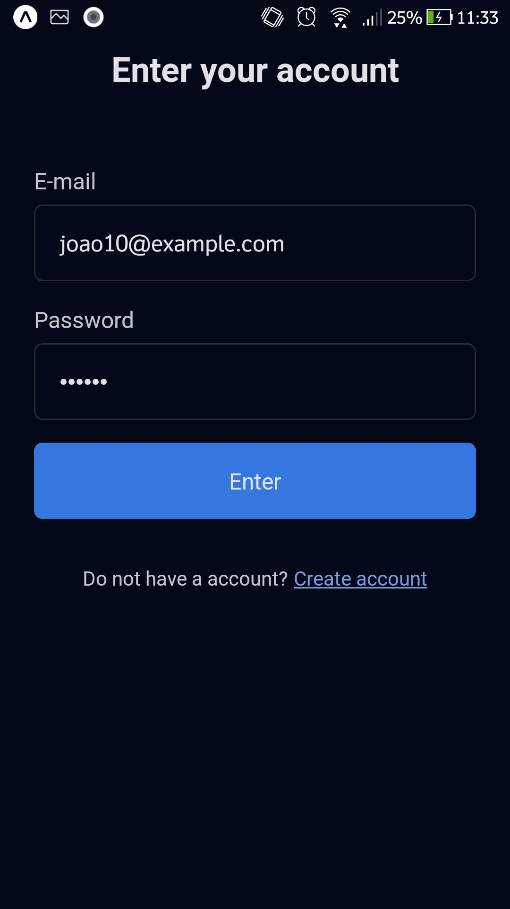
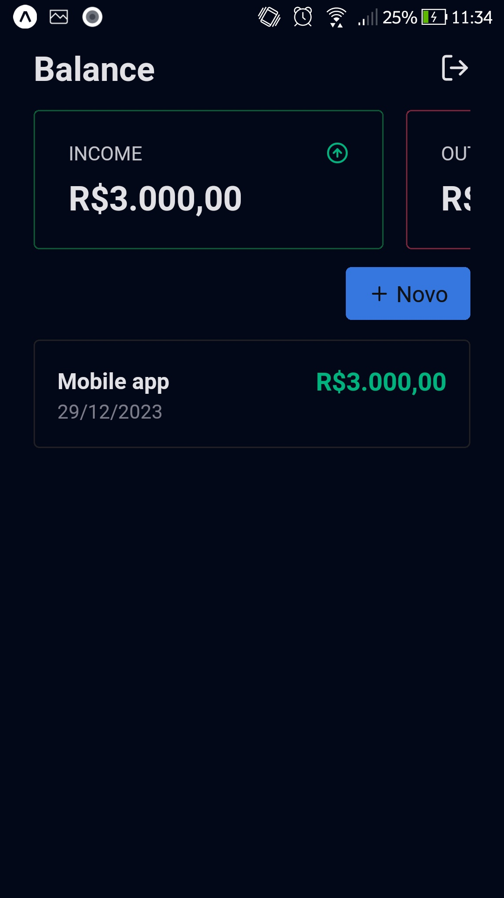
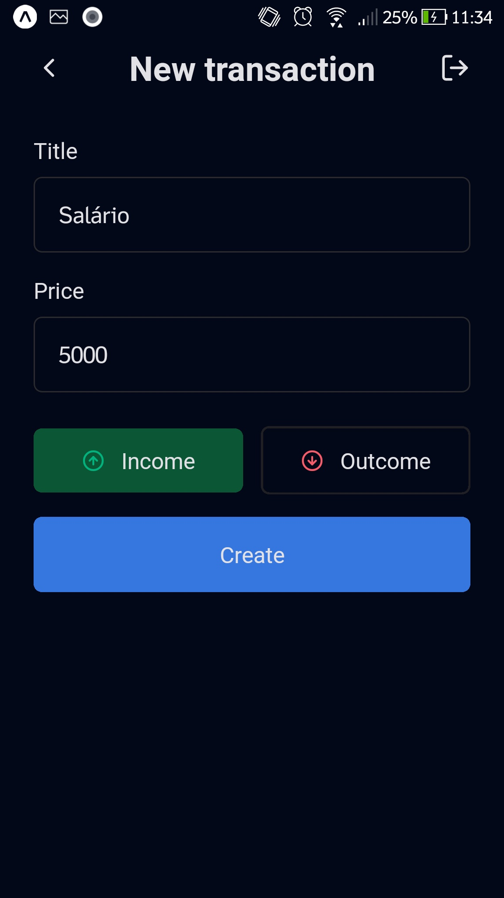
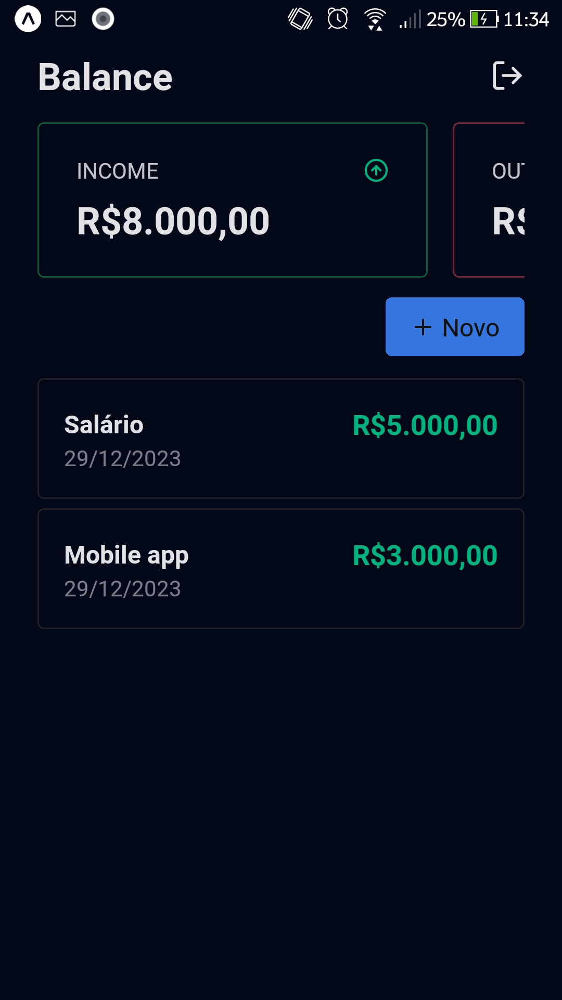

    

# Balance
Nesse projeto o cliente pode anotar todos os seus ganhos e perdas, onde no final do mês ele pode visualizar onde ele gastou e onde ele fez mais dinheiro durante um período

## Funcionalidades
- Login - email e senha
- adicionar transação
- visualizar total de gastos, total de despesas e total.

## Stack utilizada
**Mobile:** react native, expo, styled-components, typescrypt, zod e react-hook-form.

## Instalação
Primeiro faça o clone do projeto e depois siga os comandos abaixo:
```bash
 - npm install
 - npx expo start
```

## Autores
- [@RodrigoMesquita](https://www.github.com/JoaoRodrigo1996)